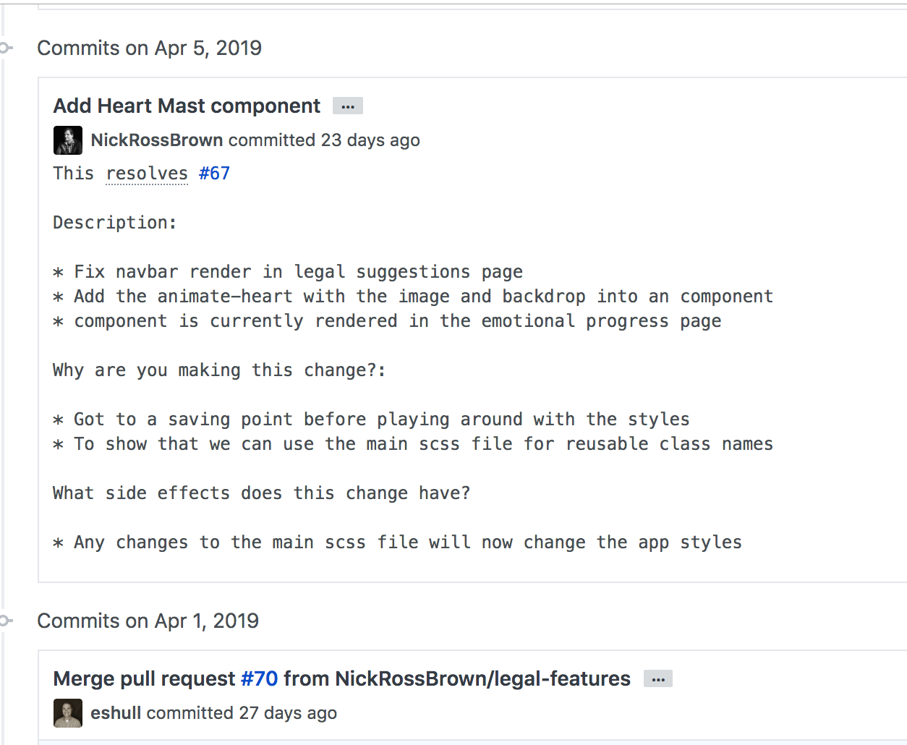

[ Return to Category Main](./index.md) / [ Return Home](/README.md)
<hr>
<hr>
<hr>

# Initial Things to Setup
<hr>
<hr>
<hr>

## Table of Contents

* [`Is git installed?`](#git-installation-check)

* [`Configure Username and Email`](#Configure-Username-Email)

* [`Writing and formatting commit messages`](#Commit-Messages)
* [`make sure to include a .gitignore file when creating new projects`](#gitignore)
* [``](#)

<hr>

## git installation check
<hr>

Make sure git is installed first
```
$ git --version
```
[⬆ Back to top](#table-of-contents)
<hr>

## Configure-Username-Email
<hr>
Does your name show up? 

```
$ git config user.name
```
- Then your git commits will not be associate with your name (guest will be used)

tutorial link for user name + user email setup
- https://alvinalexander.com/git/git-show-change-username-email-address

[⬆ Back to top](#table-of-contents)

<hr>

## Commit Messages
<hr>

* [How to write a proper git commit message](https://chris.beams.io/posts/git-commit/)

My  current git template that I use for my projects:

> Subject line: (it will...)
>
> This closes resolves fixes # (issue > number)
>
> Description:   
> *  
> *  
> * 
> 
> Why are you making this change?    
> *     
> * 
> 
> What side effects does this change have?    
> *
> 
> Helpful/used reference links:

A screenshot example of one of my random commit messages:



[⬆ Back to top](#table-of-contents)

<hr>

## Gitignore
<hr>

- Make sure a project has a .gitignore file in the directory
    - don't want to upload the projects dependencies 
[⬆ Back to top](#table-of-contents)